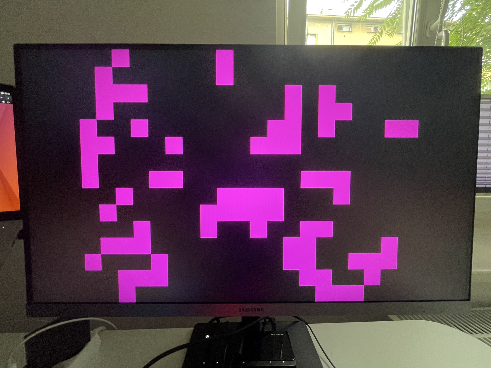
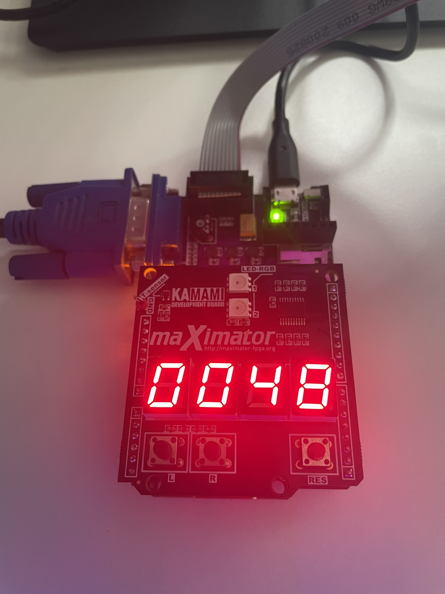
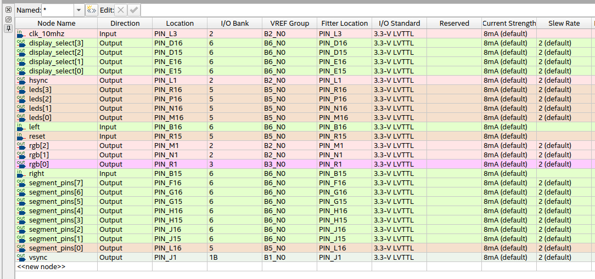

# Game of Silicon
Conway's Game of Life implementation on a Maximator FPGA

### VGA output

### Living cell counter

### Pin planner

### Demo
[Watch on YouTube](https://www.youtube.com/watch?v=65jerzMBm1s)
